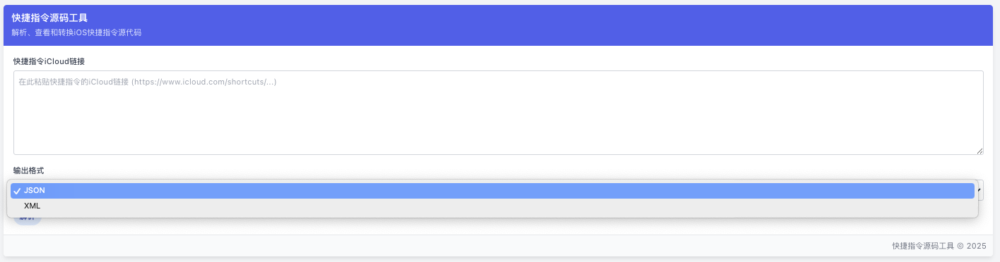

# 快捷指令源码工具

_[English](./README_EN.md)_ | _中文_

快捷指令源码工具是一个用于解析、查看和转换iOS快捷指令源代码的全栈应用。它能从iCloud链接直接获取快捷指令源码，支持JSON和XML格式输出，并提供友好的界面展示快捷指令内容和结构。

## 在线演示

🚀 **[立即体验: https://sccode.900707.xyz/](https://sccode.900707.xyz/)**

## 应用截图

### 输入界面


### 结果界面


## 项目来源

本项目的思路参考了以下工具：
- [0xdevalias的Shortcuts解析工具](https://gist.github.com/0xdevalias/27d9aea9529be7b6ce59055332a94477) - 关于如何将Apple快捷指令工作流解析为其原始XML"源代码"的笔记
- [RoutineHub上的Shortcut Source Tool](https://routinehub.co/shortcut/5256/) - 一个用于查看、转换和保存快捷指令源码的快捷指令

## 项目组成

本项目包含两个主要部分：

1. **API服务 (ShortcutAPI)**
   - 负责从iCloud链接提取快捷指令源代码
   - 基于FastAPI开发的Python服务
   - 支持Docker容器化部署

2. **Web前端 (ShortcutSourceWeb)**
   - 提供用户友好的界面
   - 基于React和TypeScript开发
   - 适配各种设备的响应式设计
   - 可以直接发布到Cloudflare Pages直接运行

## 功能特点

- **源码获取**: 从iCloud链接提取iOS快捷指令源代码
- **格式转换**: 支持JSON和XML格式
- **动作解析**: 解析并显示快捷指令动作列表
- **元数据查看**: 查看快捷指令的名称、版本等信息
- **导出功能**: 支持下载和复制源码

## 快速开始

### 后端API

后端API负责从iCloud链接获取快捷指令源码。

```bash
# 进入API目录
cd ShortcutAPI

# 安装依赖
pip install -r requirements.txt

# 运行服务
python app.py
```

详细文档请查看 [ShortcutAPI/README.md](./ShortcutAPI/README.md)

### 前端Web应用

前端提供用户界面，让用户可以输入iCloud链接并查看结果。

```bash
# 进入Web目录
cd ShortcutSourceWeb

# 安装依赖
pnpm install

# 开发模式运行
pnpm dev
```

详细文档请查看 [ShortcutSourceWeb/README.md](./ShortcutSourceWeb/README.md)

## 部署指南

本项目可以部署到各种环境。针对不同部分的详细部署说明，请参考各自的README文件。

### API部署

API服务可以通过Docker容器化部署，也可以直接部署在支持Python的环境中。

### Web前端部署

前端可以部署到任何静态网站托管服务上，如Cloudflare Pages（已验证✅）。

## 跨域问题排查

由于前端和API通常部署在不同域名下，可能会遇到CORS（跨域资源共享）问题。已知的问题和解决方案：

1. **重复CORS头**: 如果使用Cloudflare，可能会添加重复的CORS头，导致浏览器报错。
   - 解决方案: 将Cloudflare的SSL/TLS模式设置为"Full"或"Full (Strict)"，或者关闭Cloudflare代理（灰云模式）。

2. **API服务CORS设置**: 确保API服务正确配置了CORS头。
   - 解决方案: 检查API服务和反向代理(如Nginx)的配置，确保不会重复添加CORS头。

## 贡献指南

欢迎贡献代码、报告问题或提出改进建议！

1. Fork 本仓库
2. 创建您的特性分支 (`git checkout -b feature/amazing-feature`)
3. 提交您的更改 (`git commit -m 'Add some amazing feature'`)
4. 推送到分支 (`git push origin feature/amazing-feature`)
5. 打开Pull Request

## 许可证

本项目采用 MIT 许可证 - 详情参见 [LICENSE](LICENSE) 文件
