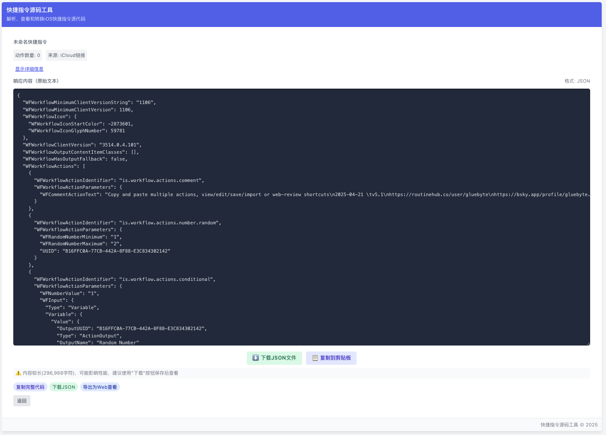

# Shortcut Source Tool

_English_ | _[中文](./README.md)_

Shortcut Source Tool is a full-stack application for parsing, viewing, and converting iOS Shortcuts source code. It can directly retrieve shortcut source code from iCloud links, supports JSON and XML output formats, and provides a user-friendly interface to display shortcut content and structure.

## Live Demo

🚀 **[Try it now: https://sccode.900707.xyz/](https://sccode.900707.xyz/)**

## Screenshots

### Input Screen


### Result Screen


## Project Inspiration

This project was inspired by the following tools:
- [0xdevalias's Shortcuts Decompilation Notes](https://gist.github.com/0xdevalias/27d9aea9529be7b6ce59055332a94477) - Notes on decompiling Apple Shortcuts workflows into their raw XML 'source code'
- [Shortcut Source Tool on RoutineHub](https://routinehub.co/shortcut/5256/) - A shortcut for viewing, converting, and saving shortcut source code

## Project Components

This project consists of two main parts:

1. **API Service (ShortcutAPI)**
   - Responsible for extracting shortcut source code from iCloud links
   - Python service based on FastAPI
   - Supports Docker containerized deployment

2. **Web Frontend (ShortcutSourceWeb)**
   - Provides a user-friendly interface
   - Developed with React and TypeScript
   - Responsive design that adapts to various devices
   - Can be directly published to Cloudflare Pages

## Features

- **Source Code Retrieval**: Extract iOS Shortcuts source code from iCloud links
- **Format Conversion**: Support for JSON and XML formats
- **Action Parsing**: Parse and display shortcut action lists
- **Metadata Viewing**: View shortcut name, version, and other information
- **Export Functions**: Support for downloading and copying source code

## Quick Start

### Backend API

The backend API is responsible for retrieving shortcut source code from iCloud links.

```bash
# Enter the API directory
cd ShortcutAPI

# Install dependencies
pip install -r requirements.txt

# Run the service
python app.py
```

For detailed documentation, please see [ShortcutAPI/README.md](./ShortcutAPI/README.md)

### Frontend Web Application

The frontend provides a user interface for users to input iCloud links and view results.

```bash
# Enter the Web directory
cd ShortcutSourceWeb

# Install dependencies
pnpm install

# Run in development mode
pnpm dev
```

For detailed documentation, please see [ShortcutSourceWeb/README.md](./ShortcutSourceWeb/README.md)

## Deployment Guide

This project can be deployed to various environments. For detailed deployment instructions for different parts, please refer to their respective README files.

### API Deployment

The API service can be deployed via Docker containerization or directly on environments that support Python.

### Web Frontend Deployment

The frontend can be deployed to any static website hosting service, such as Cloudflare Pages (verified ✅).

## CORS Troubleshooting

Since the frontend and API are typically deployed on different domains, you may encounter CORS (Cross-Origin Resource Sharing) issues. Known issues and solutions:

1. **Duplicate CORS Headers**: If using Cloudflare, it may add duplicate CORS headers, causing browser errors.
   - Solution: Set Cloudflare's SSL/TLS mode to "Full" or "Full (Strict)", or disable Cloudflare proxy (gray cloud mode).

2. **API Service CORS Settings**: Ensure the API service has correctly configured CORS headers.
   - Solution: Check the configuration of the API service and reverse proxy (such as Nginx) to ensure CORS headers are not added redundantly.

## Contribution Guidelines

Contributions to code, issue reports, or improvement suggestions are welcome!

1. Fork this repository
2. Create your feature branch (`git checkout -b feature/amazing-feature`)
3. Commit your changes (`git commit -m 'Add some amazing feature'`)
4. Push to the branch (`git push origin feature/amazing-feature`)
5. Open a Pull Request

## License

This project is licensed under the MIT License - see the [LICENSE](LICENSE) file for details 